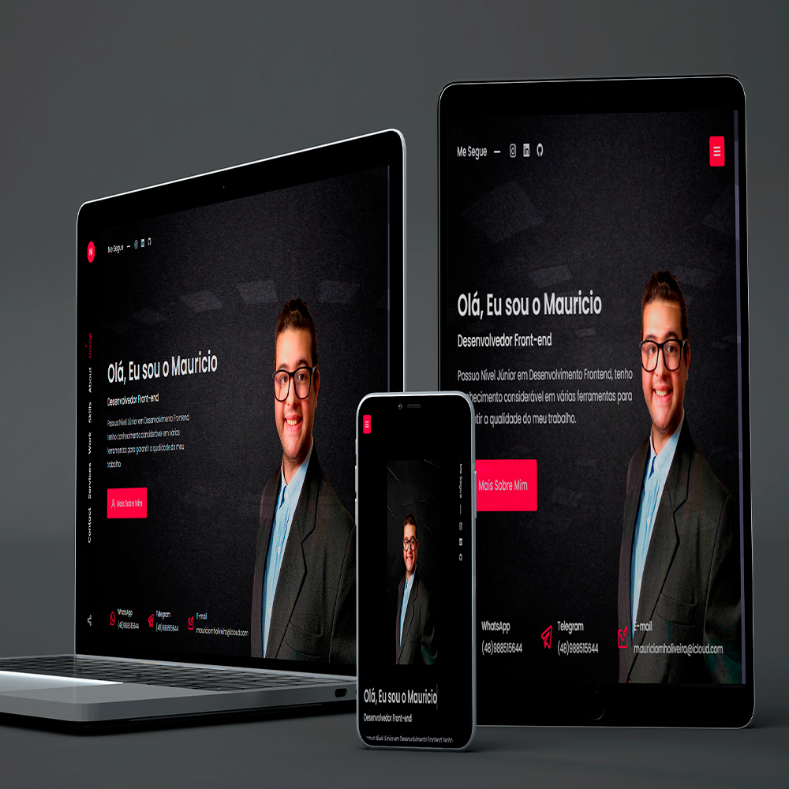

  <a href="#-tecnologias">Tecnologias</a>&nbsp;&nbsp;&nbsp;|&nbsp;&nbsp;&nbsp;
  <a href="#-projeto">Projeto</a>&nbsp;&nbsp;&nbsp;|&nbsp;&nbsp;&nbsp;
  <a href="#-layout">Layout</a>&nbsp;&nbsp;&nbsp;|&nbsp;&nbsp;&nbsp;
  <a href="#memo-licença">Licença</a>

 

  

 

## 🚀 Tecnologias

Esse projeto foi desenvolvido com as seguintes tecnologias:

- HTML
- CSS
- JavaScript

Bibliotecas

- [Google Fonts](https://fonts.google.com/)
- [SwipeJS](https://github.com/nolimits4web/Swiper)
- [ScrollReveal](https://scrollrevealjs.org)

Utilitários

- [BoxIcons](https://boxicons.com/)
- [UniIcons](https://iconscout.com/unicons)

 

## 💻 Projeto

O projeto é uma página institucional no formato One Page, responsiva, para mostrar meu portfólio. Contém as seguintes seções: Header, Navigation, Home, Sobre, Qualificações, Serviços, Depoimentos, Contato e Footer

## 🔖 Layout

Você pode visualizar o layout do projeto através [desse link](http://portfolio-topaz-tau.vercel.app/).

## 📝 Licença

Esse projeto está sob a licença MIT. Veja o arquivo [LICENSE](.github/LICENSE.md) para mais detalhes.

---

Criado na NLW da Rocketseat
